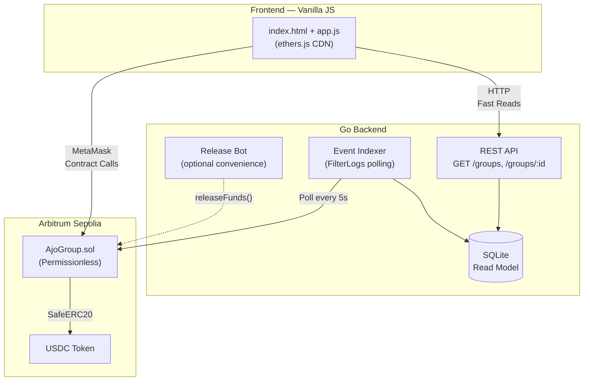

# AjoChain ⬡

**On-chain group contribution and auto-release payments — a digital version of the West African "ajo" rotating savings model.**

Built for the [Arbitrum Open House Singapore Buildathon](https://www.hackquest.io/) — Solidity + Rust track, financial products theme.

---

## 🌍 Why AjoChain?

In West Africa, **"ajo"** (Yoruba) or "esusu" is a centuries-old practice where a group of people pool money regularly, and the total pot rotates to each member in turn. It's how millions of people save, pay rent, and split bills — without banks.

**AjoChain brings this model on-chain:**

- A group of people commits to a shared payment target (rent, subscription, emergency fund).
- Each member contributes USDC toward the target.
- **Once the target is met, anyone can trigger the release** — no admin, no backend, no middleman.
- If the deadline passes without meeting the target, members can reclaim their contributions.

This is **programmable money for collective action** — and it works for any group payment: roommates splitting rent, teams pooling for a shared service, or communities funding a project.

---

## 🏗 Architecture



**Design principle:** The smart contract is the **sole source of truth**. The Go backend is a performance optimization (fast reads via SQLite) and a convenience layer (optional release bot). The frontend works directly with the contract via MetaMask — no backend dependency for core flows.

---

## 🔑 Key Feature: Permissionless Release

The star of the demo: `releaseFunds()` is a **public function with no access control**. Once the contribution target is met, literally anyone — a group member, the convenience bot, or even a judge with their own wallet — can trigger the release. The contract checks the condition and pays out. No keys, no admin, no trust required.

---

## 📁 Project Structure

```
Ajochain/
├── contracts/               # Solidity (Foundry project structure)
│   ├── src/
│   │   └── AjoGroup.sol     # Core contract
│   └── test/
│       ├── AjoGroup.t.sol   # Foundry test suite (9 test cases)
│       └── mocks/
│           └── MockUSDC.sol # Test-only ERC20 mock
├── backend/                 # Go backend service
│   ├── cmd/server/          # Single-binary entry point
│   ├── internal/
│   │   ├── api/             # REST handlers (chi router)
│   │   ├── config/          # Env-based configuration
│   │   ├── contracts/       # ABI bindings (manual, no abigen)
│   │   ├── indexer/         # On-chain event indexer
│   │   ├── relayer/         # Optional release bot
│   │   └── store/           # SQLite read model
│   └── .env.example
├── frontend/                # Static web frontend
│   ├── index.html           # Single-page app
│   ├── style.css            # Dark theme design system
│   └── app.js               # Wallet + contract logic
├── Makefile
└── README.md
```

---

## 🚀 Quick Start

### 1. Deploy the Contract (via Remix)

1. Open [Remix IDE](https://remix.ethereum.org)
2. Create a new file, paste the contents of `contracts/src/AjoGroup.sol`
3. Install OpenZeppelin dependencies (Remix auto-resolves `@openzeppelin/contracts/`)
4. Compile with Solidity 0.8.24+
5. Deploy to **Arbitrum Sepolia** with your USDC token address as the constructor argument
6. Note the deployed contract address

### 2. Configure the Frontend

Edit `frontend/app.js` — update the `CONFIG` object at the top:

```javascript
const CONFIG = {
    AJOGROUP_ADDRESS: '0x_YOUR_DEPLOYED_CONTRACT',
    USDC_ADDRESS: '0x_YOUR_USDC_TOKEN',
    // ... rest stays the same
};
```

### 3. Open the Frontend

Just open `frontend/index.html` in your browser — no build step needed!

Or serve it via the Go backend:

```bash
cd backend
cp .env.example .env
# Edit .env with your contract address and RPC URL
go run ./cmd/server
# Visit http://localhost:8080
```

### 4. Run Foundry Tests (optional, requires Foundry)

```bash
cd contracts
forge install OpenZeppelin/openzeppelin-contracts foundry-rs/forge-std
forge test -vvv
```

---

## 🧪 Test Coverage

| Test | Description |
|------|-------------|
| `test_CreateGroup` | Group creation with correct state |
| `test_HappyPath_CreateContributeRelease` | Full lifecycle: create → contribute → permissionless release |
| `test_RefundPath_DeadlinePassedTargetNotMet` | Partial contribution + refund after deadline |
| `test_DoubleReleasePrevention` | Re-calling releaseFunds reverts |
| `test_NonMemberContributionRejection` | Non-member can't contribute |
| `test_ContributeAfterDeadline` | Late contributions revert |
| `test_ContributeAfterRelease` | Post-release contributions revert |
| `test_RefundBeforeDeadline` | Early refund attempts revert |
| `test_RefundWhenTargetMet` | Refund blocked when target is met |
| `test_InvalidGroupId` | Non-existent group access reverts |

---

## 🛡 Security Notes

> **This is a hackathon MVP, not production code.** The following security measures are in place, but a formal audit is recommended before any mainnet deployment.

- ✅ `ReentrancyGuard` on `releaseFunds` and `refund`
- ✅ Checks-Effects-Interactions (CEI) pattern throughout
- ✅ `SafeERC20` for all USDC transfers
- ✅ No owner/admin/backdoor — fully permissionless
- ✅ Input validation (zero address, zero amount, deadline in future)
- ⚠️ Duplicate member addresses not checked on-chain (gas optimization)
- ⚠️ No contribution cap per member
- ⚠️ Lines marked `// SECURITY-REVIEW:` need manual verification

---

## 🛠 Tech Stack

| Layer | Technology |
|-------|-----------|
| Smart Contract | Solidity 0.8.24, OpenZeppelin |
| Contract Testing | Foundry (forge) |
| Contract Deployment | Remix IDE |
| Backend | Go 1.22+, go-ethereum, chi, SQLite |
| Frontend | Vanilla JS, ethers.js 6.x |
| Network | Arbitrum Sepolia (testnet) |

---

## 👥 Team

*[Your team info here]*

---

## 📜 License

MIT
